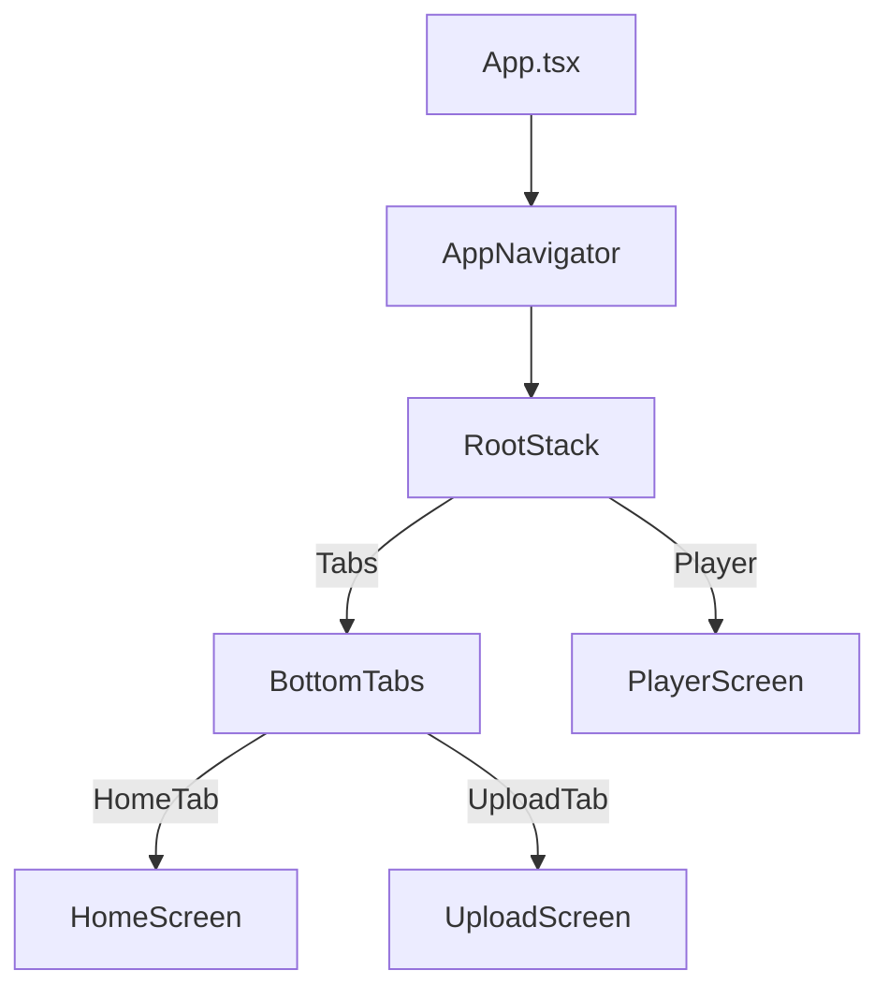
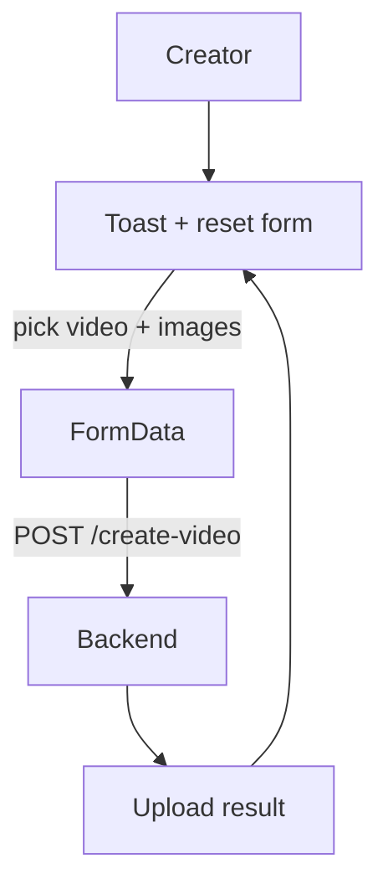
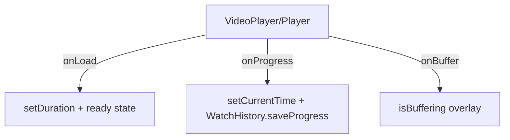
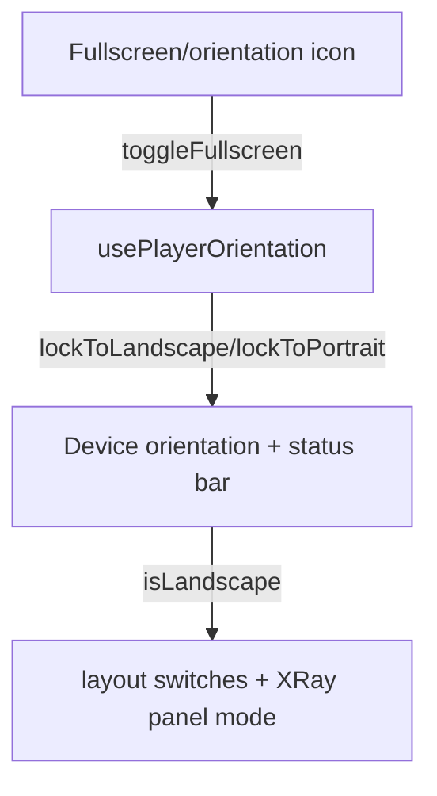

# Fitistan OTT Frontend Architecture (React Native CLI)

This document is a “production engineer style” deep dive into the **frontend** inside `shoppableOTT` — how the app launches, how navigation works, how the OTT video player works (including PiP, gestures, seek + buffering), and how the **Shop Here / X-Ray** system turns *pause moments* into *product results* from your backend.

It is written to help you explain the system confidently in interviews: **what** the code does, **why** it exists, and **how** data and events flow through the UI.

> Scope note: Your current codebase is small and focused (Home, Upload, Player) but the **player** is feature-rich. The most important “interview files” are `Player.tsx`, `SeekBar.tsx`, `GestureLayer.tsx`, `XRayPanel.tsx`, `XRaySidePanel.tsx`, and the API/services + hooks around them.

---

## 1. Project Overview

### What this app does
This is an OTT-style React Native app where users:
1. Browse videos on a Home screen (with an autoplay “hero carousel”).
2. Upload and publish new *shoppable* videos (video + product metadata + product images).
3. Watch a video in a rich player that supports:
   - Tap / double-tap / long-press gestures (seek + 2× preview)
   - Brightness/volume swipe HUD
   - Seekbar with drag gesture
   - Auto-hiding controls overlay
   - Fullscreen/orientation changes
   - Picture-in-picture (PiP)-like floating mini player
   - **Shop Here / X-Ray**: when the user pauses, the app queries the backend for products detected in that moment and shows a shop UI.

### Main objective
Turn a standard video playback experience into an **interactive commerce experience**:
- “Pause at the right moment” → backend detection → “Shop Here” UI with matching products.

### Core features (frontend)
- Navigation:
  - Bottom tabs: Home + Upload
  - Player is a modal-like stack screen (`presentation: "transparentModal"`)
- Video playback:
  - `react-native-video` for playback
  - `react-native-reanimated` for performant animated UI + PiP dragging
  - `react-native-gesture-handler` for gestures
- Shop Here / X-Ray:
  - `/pause` endpoint called with `currentTime` + `videoId`
  - Bottom sheet in portrait, side panel in landscape

### Technologies used (key packages)
Frontend relies on:
- React 19 (`react`)
- React Native 0.85 (`react-native`)
- Navigation:
  - `@react-navigation/native`
  - `@react-navigation/native-stack`
  - `@react-navigation/bottom-tabs`
- Video:
  - `react-native-video`
- Gestures:
  - `react-native-gesture-handler`
- Animations:
  - `react-native-reanimated`
- UI:
  - `react-native-linear-gradient` (Home hero gradients, OTT UI)
  - `@react-native-community/slider` (legacy `VideoControls.tsx` only; current SeekBar is custom)
  - `react-native-orientation-locker` (fullscreen/orientation control)
  - `react-native-safe-area-context` (safe areas)

### Overall architecture (high-level)
Your app follows a simple feature-based structure:
- `src/features/home/*`
- `src/features/upload/*`
- `src/features/player/*`

The most important “architecture split” is:
- **Screens**: orchestration, navigation, calling APIs
- **Player components**: rich UI + animations + gestures
- **Services**: API wrappers (fetch/xhr)
- **Hooks**: playback state, auto-hide logic, orientation logic, etc.

---

### End-to-end workflow (requested)
User
  ↓
Home Screen (`HomeScreen.tsx`)
  ↓ (tap a card/hero)
Player Screen (`PlayerScreen.tsx`)
  ↓
Video Player UI (`VideoPlayer/Player.tsx`)
  ↓
User pauses video
  ↓
Pause detection API (`pauseDetectionApi` → `POST /pause`)
  ↓
Backend returns `matchedProducts`
  ↓
Shop Here UI (`XRayPanel` / `XRaySidePanel`)
  ↓
Products rendered as `ProductCard`

#### Workflow diagram (Mermaid)
```mermaid
flowchart TD
  U[User] --> H[HomeScreen]
  H -->|Select video| PScreen[PlayerScreen]
  PScreen --> Player[VideoPlayer/Player.tsx]
  Player -->|Pause (user tap)| PScreen
  PScreen -->|POST /pause(currentTime, videoId)| API[Backend]
  API -->|matchedProducts| PScreen
  PScreen -->|sceneProducts| XR[XRayPanel/XRaySidePanel]
  XR --> Products[ProductCard list]
```

---

## 2. Complete Folder Structure Explanation

### Folder structure (actual)
Below is the structure that exists in your repo (based on the TS/TSX files present):

```text
shoppableOTT/
  index.js
  App.tsx
  src/
    app/
      navigation/
        AppNavigator.tsx
        RootStack.tsx
        BottomTabs.tsx
        CustomTabBar.tsx
        types.ts
    components/
      OTTCard.tsx
      SkeletonLoader.tsx
    features/
      home/
        screens/
          HomeScreen.tsx
        services/
          homeApi.ts
          watchHistory.ts
        types/
          home.types.ts
      upload/
        screens/
          UploadScreen.tsx
        services/
          uploadApi.ts
      player/
        screens/
          PlayerScreen.tsx
        components/
          VideoPlayer.tsx
          VideoPlayer/
            Player.tsx
            SeekBar.tsx
            GestureLayer.tsx
            Controls.tsx
            TopOverlay.tsx
            XRayPanel.tsx
            XRaySidePanel.tsx
            ShopSceneSection.tsx
            ScrimOverlay.tsx
            PlayerIcons.tsx
            constants.ts
            styles/playerTheme.ts
            index.ts
          VideoControls.tsx (legacy/unused)
          ProductCard.tsx
          ProductOverlay.tsx (legacy/unused)
        hooks/
          usePlayer.ts
          usePlayerControls.ts
          usePlayerOrientation.ts
        services/
          playerApi.ts
        data/
          mockPlayerData.ts
        types/
          player.types.ts
        utils/
          formatTime.ts
    shared/
      components/
        ErrorBoundary.tsx
      constants/
        config.ts
    theme/
      index.ts
      colors.ts
      typography.ts
```

### Folder responsibilities (WHY they exist)
- `src/app/navigation/`: navigation wiring and screen registrations.
  - This is where you decide: tabs vs stack, modal presentation style, and lazy-loading.
- `src/features/*`: feature boundaries.
  - Keeps Home/Upload/Player independent so changes don’t tangle unrelated UI.
- `src/components/*`: shared UI building blocks (cards/skeletons).
- `src/features/player/components/VideoPlayer/*`: the “product” of the project: the player UX.
  - It contains almost all gesture + animation + overlay logic.
- `src/features/player/hooks/*`: isolates state logic and auto-hide/orientation policies.
- `src/shared/components/ErrorBoundary.tsx`: app-level “safety net” for crashes.
- `src/theme/*`: brand color + typography for non-player screens.

### File-by-file (quick but complete mapping)
The “full” line-by-line walkthrough is in Section 15. Here is the purpose mapping:

| File | Exists to... | Main callers |
|---|---|---|
| `index.js` | Register RN root component | RN runtime |
| `App.tsx` | Bootstraps navigation and app providers | RN runtime |
| `src/app/navigation/AppNavigator.tsx` | Create `NavigationContainer` + theme + stack root | `App.tsx` |
| `RootStack.tsx` | Tab navigator + Player screen (modal) | `AppNavigator` |
| `BottomTabs.tsx` | Bottom tab navigator | `RootStack` |
| `CustomTabBar.tsx` | Render tab bar UI | `BottomTabs` |
| `HomeScreen.tsx` | Home UI + fetch video feed + hero carousel + navigation to Player | Tabs |
| `UploadScreen.tsx` | Creator hub for uploading shoppable videos | Tabs |
| `PlayerScreen.tsx` | Orchestrate pause detection + pass products to player | Stack |
| `VideoPlayer/Player.tsx` | Video player UI: playback, gestures, overlays, PiP | `PlayerScreen` |
| `VideoPlayer/SeekBar.tsx` | Gesture-based timeline seek UI | `Player.tsx` |
| `VideoPlayer/GestureLayer.tsx` | Tap/double-tap/long-press and swipe HUD gestures | `Player.tsx` |
| `VideoPlayer/Controls.tsx` | Play/pause + 10s skip controls (animated) | `Player.tsx` |
| `VideoPlayer/TopOverlay.tsx` | Top bar: title + back + PiP + orientation controls | `Player.tsx` |
| `VideoPlayer/XRayPanel.tsx` | Portrait “Shop Here” footer + bottom sheet | `Player.tsx` |
| `VideoPlayer/XRaySidePanel.tsx` | Landscape slide-in “Shop Here” panel | `Player.tsx` |
| `features/player/services/playerApi.ts` | `POST /pause` wrapper | `PlayerScreen` |
| `features/home/services/homeApi.ts` | `GET /videos` wrapper | `HomeScreen` |
| `features/home/services/watchHistory.ts` | Local watch progress history | `Player.tsx` + `HomeScreen` |
| `features/upload/services/uploadApi.ts` | `POST /create-video` wrapper | `UploadScreen` |
| `features/player/data/mockPlayerData.ts` | Mock actors/products/markers | `Player.tsx` |
| `features/player/types/player.types.ts` | Type contracts for products/actors/markers | All player components |

---

## 3. App Entry Flow

### Step-by-step: from app launch → navigation initialization
1. **`index.js`**
   - Imports `react-native-gesture-handler` and `react-native-reanimated`.
   - Registers the root component `App` via `AppRegistry.registerComponent`.
2. **`App.tsx`**
   - Wraps UI in:
     - `ErrorBoundary` (catches render errors)
     - `GestureHandlerRootView` (required for gesture-handler)
     - `SafeAreaProvider` (safe area insets)
   - Renders `AppNavigator`.
   - Calls `enableScreens(true)` from `react-native-screens` to reduce memory/overdraw and improve navigation performance.
3. **`src/app/navigation/AppNavigator.tsx`**
   - Creates `NavigationContainer` with a dark theme.
   - Renders `RootStack`.
4. **`RootStack.tsx`**
   - Uses `createNativeStackNavigator`.
   - Defines:
     - `Tabs` screen → `BottomTabs`
     - `Player` screen → lazy-loaded component (`getComponent`) for faster initial mount.
   - `Player` options:
     - `presentation: "transparentModal"`
     - `headerShown: false`
5. **`BottomTabs.tsx`**
   - Uses bottom tab navigator.
   - `HomeTab` wraps `HomeScreen` in `ErrorBoundary`
   - `UploadTab` wraps the lazily loaded `UploadScreen` in `ErrorBoundary`
6. **`CustomTabBar.tsx`**
   - Absolute positioned tab bar (over content)
   - Uses `useSafeAreaInsets` to adjust bottom padding
   - Renders icon + label and navigates on press.

#### Navigation hierarchy diagram


---

## 4. Screen-by-Screen Explanation

### 4.1 Home Screen (`src/features/home/screens/HomeScreen.tsx`)
**Purpose**
- Fetches video list (`GET /videos`) and shows:
  - a horizontal “hero” carousel with infinite-feel scrolling
  - a vertical feed of OTT cards
  - an optional “Continue Watching” row based on locally stored watch history.

**UI structure**
- Header with brand text
- `FlatList` for vertical feed
  - `ListHeaderComponent` includes:
    - category pills (`All/Nutrition/Fitness/Wellbeing/More`)
    - error box (if fetch fails)
    - hero carousel (`FlatList` horizontal + paging)
    - continue watching row (horizontal FlatList)

**State management**
- `fetchedVideos`: API result
- `continueWatching`: local watch history results
- `loading`, `refreshing`, `error`
- `selectedCategory`
- `virtualIndex`, `activeHeroIndex`: hero carousel loop logic

**Workflow**
- On mount: `loadVideos()`
- On refresh: pull-to-refresh triggers `loadVideos(true)`
- When screen becomes focused: reads `WatchHistory.getHistory()` into `continueWatching`
- When tapping a card: navigates to `Player` stack screen with:
  - `videoUrl`, `videoId`, `title`

**Why the design exists**
- The hero carousel feels “alive” without requiring pagination from backend.
- Continue Watching is local (no backend required), but still “production friendly” for UX.

### 4.2 Upload Screen (`src/features/upload/screens/UploadScreen.tsx`)
**Purpose**
- Creator hub to upload a video and attach products/tags to enable shop moments.

**UI structure**
- `ScrollView` with:
  - video picker + preview
  - product sections (repeatable)
  - each product includes:
    - title/name
    - price
    - image picker
    - buy link
    - comma-ish tags (entered as text input)
  - submit CTA: “Publish Interactive Video”
- Overlays:
  - `UploadProgressOverlay` modal shown while uploading
  - `UploadToast` shown after upload completes successfully

**State management**
- `video` selected by document picker
- `products[]` local array of product metadata
- `uploading` + `uploadProgress` (driven by XHR progress)
- `toastVisible`

**Workflow**
1. Select a video and optionally images for each product
2. Fill product fields
3. Call `uploadVideoApi(formData, applyNetworkProgress)`
4. On completion, show toast + reset form after timeout

**Why this exists**
- Uses `XMLHttpRequest` because it provides upload progress events (`xhr.upload.onprogress`), which is useful for UX.

### 4.3 Player Screen (`src/features/player/screens/PlayerScreen.tsx`)
**Purpose**
- The orchestration layer between:
  - playback state (paused/currentTime)
  - the pause detection API call
  - the product results given to the player UI.

**Important logic**
- Uses `usePlayer()` to store:
  - `paused`, `currentTime`, `duration`
  - and setter functions used by the video component.
- Keeps `sceneProducts` state, initially empty.

**Pause detection workflow**
- `onPause` is triggered by the UI (`Player.tsx` controls).
- `handlePause`:
  1. `setPaused(true)`
  2. calls `pauseDetectionApi(currentTime, videoId)`
  3. stores `data.matchedProducts` in `sceneProducts`
- `handlePlay`:
  - `setPaused(false)` to close auto-open logic.

**Why this exists**
- Keeping API orchestration in the Screen layer prevents deep UI components from knowing API details.
- `Player.tsx` focuses on UI/animations/gestures; `PlayerScreen.tsx` focuses on “business event → API → feed products to UI”.

---

## 5. Video Player Architecture (complete workflow)

### The “real” player entry: `src/features/player/components/VideoPlayer/Player.tsx`
This component is the center of your app’s interactive UX.

It performs 4 major jobs:
1. **Playback job** (video lifecycle)
2. **Interaction job** (gestures + control overlay)
3. **Visualization job** (PiP, fullscreen/orientation, overlays)
4. **Commerce job** (pause → open X-Ray/Shop Here panel)

### Video playback integration
Your player uses:
- `react-native-video`:
  - `ref={videoRef}`
  - `source={{ uri: videoUrl }}`
  - `paused={paused}`
  - `onProgress={handleProgress}`
  - `onLoad={handleLoad}`
  - `onBuffer={handleBuffer}`
  - `onEnd` to call `onEnd?.()` and show controls

#### Playback state inputs
- `paused` and `currentTime` are controlled by parent `PlayerScreen` via `usePlayer()`.
- `displayPosition` is a local state mirror used for UI display and marker mapping.

### Player lifecycle logic (high-level)
1. **Load events**
   - `handleLoad`: stores `data.duration` in both local `videoDuration` and parent `setDuration`.
   - `handleBuffer`: tracks buffering for an overlay loader.
2. **Progress events**
   - `handleProgress`:
     - ignores updates while seeking (`isSeeking`)
     - updates `displayPosition`
     - calls `setCurrentTime`
     - saves progress into `WatchHistory` for Continue Watching.
3. **Pause / Play**
   - `handlePlayPause` triggers `onPlay` or `onPause` callbacks from `PlayerScreen`.
4. **Seek**
   - Seek interactions are coordinated with the SeekBar:
     - Seek start: pause playback to avoid jump glitches
     - Seek complete: call `videoRef.seek(value)` and optionally resume if it was playing before scrub.

### Gesture architecture (tap/skip/speed/swipe)
Gesture handling is split into:
- `GestureLayer.tsx`: horizontal tap/double-tap/long-press + vertical swipe gesture
- `SeekBar.tsx`: drag/tap gestures on timeline
- PiP dragging:
  - implemented directly in `Player.tsx` with Reanimated `Gesture.Pan()`

#### Tap rules
- Single tap: toggles controls visibility
- Double tap:
  - left side → seek back `SEEK_SKIP_SECONDS` (10s)
  - right side → seek forward `SEEK_SKIP_SECONDS` (10s)
- Long press:
  - toggles 2× speed badge (`longPress2x`)
  - implemented by setting `rate={longPress2x ? 2 : playbackRate}`

#### Swipe rules (volume/brightness)
- Swipe vertical:
  - left side adjusts `brightness` state
  - right side adjusts `volume` state
- Brightness is simulated:
  - a black overlay `opacity: 1 - brightness` is rendered
- Volume is real:
  - passed into `<Video volume={volume} />`
- HUD cards appear for ~1s after gesture ends.

### Controls overlay and auto-hide
Controls visibility is managed by `usePlayerControls()`:
- Reanimated shared values:
  - `controlsOpacity`
  - `controlsVisible`
- It auto-hides controls after inactivity unless:
  - paused
  - isSeeking
  - settings menu open
  - X-Ray sheet open

This is why your UI feels “premium”:
- It doesn’t disappear while users are interacting.
- It fades smoothly using Reanimated (`withTiming`).

### Fullscreen/orientation + minimal X-Ray mode
Fullscreen/orientation is handled by `usePlayerOrientation()`:
- Locks device orientation using `react-native-orientation-locker`
- Hides status bar in fullscreen
- Tracks `isLandscape`

In `Player.tsx`:
- `isLandscape` controls the layout.
- When X-Ray is open in landscape, `controlsMinimal` becomes `true`:
  - `Controls.tsx` hides skip buttons (rewind/forward) when minimal.

### PiP (Picture in Picture) implementation
PiP is implemented *inside the player* (not native OS PiP):
- When `isPip` is true:
  - the main video layout becomes a floating absolute-positioned mini player
  - the mini player can be dragged using Reanimated pan gesture.

PiP is triggered from `TopOverlay`:
- portrait mode → PiP icon triggers:
  - `setIsPip(true)`
  - `exitFullscreen()` (so PiP takes effect).

---

## 6. Shop Here / X-Ray System (deep flow)

### Conceptual flow (requested)
User pauses video
  ↓
Frontend sends `currentTime` + `videoId`
  ↓
POST `/pause` API call
  ↓
Backend returns `matchedProducts`
  ↓
Frontend renders Shop Here UI (cards)

### Actual frontend flow in your code
1. `PlayerScreen.tsx` owns:
   - `paused/currentTime/duration` (via `usePlayer()`)
   - `sceneProducts[]`
2. User pauses:
   - `Player.tsx` calls `onPause?.()` which is `handlePause` in `PlayerScreen`.
3. `handlePause`:
   - sets `paused=true`
   - calls `pauseDetectionApi(currentTime, videoId)`
   - stores `matchedProducts` into `sceneProducts`
4. `Player.tsx`:
   - uses `paused` to decide if X-Ray should open.
   - opens the correct panel:
     - portrait → `XRayPanel` bottom sheet
     - landscape → `XRaySidePanel` slide-in panel.
5. `XRayPanel` / `XRaySidePanel` render:
   - `ProductCard` for each matched product
   - “Buy Now” button opens `buyLink` via `Linking.openURL`.

#### Flow diagram
```mermaid
flowchart TD
  U[User] -->|Pause| PS[PlayerScreen]
  PS --> API[POST /pause(currentTime, videoId)]
  API --> R[matchedProducts[]]
  R --> PS
  PS --> P[VideoPlayer/Player.tsx]
  P --> XR[Shop Here UI]
  XR --> PC[ProductCard...]
```

### Backend endpoints used by the frontend (Shop moments)
- `POST ${BASE_URL}/pause`
  - request body:
    - `currentTime`
    - `videoId`
  - response:
    - `matchedProducts` (typed as `ProductType[]` in your player types)

### Detections timestamps (markers on the timeline)
Separately from pause detection:
- `Player.tsx` fetches detections markers via:
  - `fetch(`${BASE_URL}/videos/${id}/detections`)`
  - sets `apiMarkerTimes[]`
- `mergeMarkers(apiMarkerTimes, mockMarkers)` produces a combined `SceneMarker[]`.

Important reality check:
- Your `SeekBar.tsx` currently **does not render markers circles** even though it accepts `markers` in its props.
- Your older/legacy timeline marker rendering exists in `VideoControls.tsx`.

So in the current UI:
- markers influence the data model,
- but the seekbar visuals do not yet display them.

---

## 7. Component Architecture

Your component hierarchy for the player is conceptually:

```text
PlayerScreen
  └── VideoPlayer/Player (main UI)
       ├── react-native-video (playback)
       ├── GestureLayer (tap/double-tap/long-press/swipe HUD)
       ├── TopOverlay (title + icons: back, PiP, settings, orientation)
       ├── Controls (play/pause + 10s skips)
       ├── SeekBar (timeline seek gestures)
       ├── XRayPanel (portrait footer + bottom sheet)
       ├── XRaySidePanel (landscape side shop panel)
       └── ProductCard (reusable product tile)
```

### Reusable components (what they do + why)

#### `VideoPlayer/Controls.tsx`
- Purpose:
  - Render play/pause and optional rewind/forward.
  - Fade in/out via Reanimated shared `controlsOpacity`.
- Why it exists:
  - Keeps the control UI separate from the heavy player component logic.
  - Allows “minimal controls mode” for the X-Ray overlay scenario.

#### `VideoPlayer/SeekBar.tsx`
- Purpose:
  - Provide a draggable timeline using Reanimated shared values.
  - Use gestures to map touch X → seek time.
- Why it exists:
  - You want smooth and responsive timeline interactions without waiting for JS timers.

#### `VideoPlayer/GestureLayer.tsx`
- Purpose:
  - Implement tap/double-tap logic and long-press speed mode.
  - Implement vertical swipe for brightness and volume.
- Why it exists:
  - Gesture logic is complex and should be isolated from rendering.

#### `VideoPlayer/TopOverlay.tsx`
- Purpose:
  - Top chrome with title and control icons.
  - Reuses `controlsOpacity` for fading.
- Why it exists:
  - Keeps “header UI” independent from the rest of overlay.

#### `VideoPlayer/XRayPanel.tsx`
- Purpose:
  - Portrait “Shop Here” bottom footer + draggable bottom sheet.
- Why it exists:
  - Bottom sheets need special gesture handling and layering with `Modal`.

#### `VideoPlayer/XRaySidePanel.tsx`
- Purpose:
  - Landscape shop panel slides in from the right using Reanimated translateX.
- Why it exists:
  - In landscape there’s more horizontal space; a side panel avoids covering video controls.

#### `ProductCard.tsx`
- Purpose:
  - Render a product tile and “Buy Now” CTA.
- Why it exists:
  - Decouples “how a product looks” from “where it’s shown”.

#### `OTTCard.tsx`
- Purpose:
  - Shared card UI used in Home feed and Continue Watching.

#### `SkeletonLoader.tsx`
- Purpose:
  - Display loading placeholders while `HomeScreen` fetches videos.

---

## 8. State Management

Your state is **not** Redux-based; it’s a mix of:
- React `useState` (for business state: paused/currentTime/duration and UI menus)
- refs (`useRef`) for storing stable mutable values and timers
- Reanimated shared values (`useSharedValue`) for performant animation state

### Where state lives
1. `usePlayer()` in `src/features/player/hooks/usePlayer.ts`
   - owns:
     - `paused`
     - `currentTime`
     - `duration`
     - `showControls` (note: in current code the main UI uses reanimated `controlsOpacity`; `showControls` from hook is not heavily used in `Player.tsx`)
2. `Player.tsx` local state
   - controls and overlays:
     - `settingsOpen`, `speedMenuOpen`
     - `xrayOpen`, `xrayDismissed`
     - `playbackRate` and `longPress2x`
     - PiP: `isPip`
     - brightness/volume HUD: `showBrightnessHUD`, `showVolumeHUD`
3. Reanimated shared values
   - `controlsOpacity` (auto hide)
   - PiP position: `pipX`, `pipY`
   - bottom sheet translation: `translateY`
   - seekbar drag state: `thumbScale`, `dragProgress`

### Why hooks are used (interview reasoning)
- `useCallback`:
  - prevents re-creating handlers and helps child memoization.
- `useMemo`:
  - marker merging can be expensive; it’s derived from API marker times and metadata.
- `useImperativeHandle`:
  - allows external controllers (future expansions) to call `seekTo()` or `toggleFullscreen()` through a ref.

---

## 9. API Layer

### API organization
- `src/features/home/services/homeApi.ts`
  - `fetchVideosApi()`
- `src/features/player/services/playerApi.ts`
  - `pauseDetectionApi(currentTime, videoId)` → `POST /pause`
- `src/features/upload/services/uploadApi.ts`
  - `uploadVideoApi(formData, onProgress?)` → `POST /create-video`

`src/shared/constants/config.ts` provides:
- `BASE_URL = "http://192.168.29.235:5000"`

---

### Endpoint list (frontend calls)
1. `GET /videos`
   - used in `HomeScreen` via `fetchVideosApi`
2. `POST /pause`
   - used in `PlayerScreen` via `pauseDetectionApi`
3. `POST /create-video`
   - used in `UploadScreen` via `uploadVideoApi`
4. `GET /videos/:id/detections`
   - called directly in `Player.tsx` via `fetchMarkers` to build marker timestamps for timeline

---

### Error handling & loading management
- Home:
  - `HomeScreen` sets `loading` and `error` based on fetch status.
- Player:
  - `Player.tsx` shows `ActivityIndicator` while `onBuffer` indicates buffering.
  - `PlayerScreen` catches pause detection errors and clears `sceneProducts` on failure.
- Upload:
  - Upload progress overlay always reflects current progress and uses XHR `onprogress`.
  - Toast is shown on completion (even if error happens, your code calls `finishUpload()` in catch too).

---

## 10. Animation System

Your animation system has two types:
1. **Reanimated** (performance-friendly worklets)
2. **React Native Animated** (used in Upload toast + progress overlay)

### Reanimated pieces (video experience)

#### 10.1 Controls auto-hide (`usePlayerControls.ts`)
- `controlsOpacity` is a `useSharedValue(1)`
- `scheduleAutoHide()` sets a timer:
  - If user is not paused, not seeking, and menus are closed:
  - after `AUTO_HIDE_CONTROLS_MS` (3000ms) fade controls out:
    - `withTiming(0, { duration: CONTROLS_FADE_MS })`

This is tied into UI via:
- `Player.tsx` `overlayStyle = useAnimatedStyle(() => ({ opacity: controlsOpacity.value }))`
- `Controls.tsx` uses `controlsOpacity` too.

#### 10.2 SeekBar drag + thumb scaling (`SeekBar.tsx`)
- Drag gestures are handled via `GestureDetector` with:
  - `Gesture.Pan()` for drag
  - `Gesture.Tap()` for tap-to-seek
  - `Gesture.Race(pan, tap)` ensures correct behavior.
- It maps `x / trackWidth` → `ratio` → `time`.
- It calls `onSeekStart`, `onSeekChange`, `onSeekComplete` with `runOnJS`.

#### 10.3 Bottom sheet animation (`XRayPanel.tsx`)
- `translateY` is a shared value initially set to `SHEET_HEIGHT`.
- On open:
  - `translateY.value = withSpring(0, ...)`
- On close:
  - `translateY.value = withTiming(SHEET_HEIGHT, ..., () => runOnJS(onCloseSheet)())`
- Pan gesture:
  - While dragging down, `translateY` follows user finger.
  - On release, velocity/position decides whether to close or snap back.

#### 10.4 PiP dragging (Player.tsx)
- PiP uses shared values:
  - `pipX`, `pipY`
- Pan gesture updates:
  - `pipX.value = startX.value + e.translationX`
  - `pipY.value = startY.value + e.translationY`

### React Native Animated pieces (Upload)
- Toast uses `Animated.Value` for opacity + translateY with `Animated.timing`.
- Upload overlay uses `Modal` and shows percent bar.

---

## 11. Data Flow (flowcharts)

### 11.1 Video upload flow


### 11.2 Video playback flow


### 11.3 Pause detection flow
```mermaid
flowchart TD
  User -->|Pause action| PlayerUI[Player.tsx]
  PlayerUI -->|onPause| Screen[PlayerScreen.tsx]
  Screen --> API[POST /pause]
  API --> Matched[matchedProducts]
  Matched --> Screen --> SceneProducts[sceneProducts[]]
  SceneProducts --> XRay[XRayPanel/XRaySidePanel]
```

### 11.4 Product matching flow
The frontend doesn’t do similarity matching itself. It delegates to backend:
- It sends `currentTime` and `videoId`
- Backend returns `matchedProducts`
- Frontend maps them directly into UI.

### 11.5 PiP flow
```mermaid
flowchart TD
  Portrait[TopOverlay in portrait] -->|PiP button| Player[Player.tsx]
  Player -->|setIsPip(true)| Mini[Animated.View PiP container]
  Mini -->|Pan gesture| Move[Reanimated pipX/pipY]
```

### 11.6 Fullscreen/orientation flow


---

## 12. Performance Optimization

This project uses multiple “production-engineer” performance tactics:

### 12.1 Lazy loading the Player screen
In `RootStack.tsx`:
- Player screen is lazy-loaded using `getComponent`.

Why:
- `react-native-video` + Reanimated native dependencies can be heavy.
- Lazy loading allows Home/Upload to mount faster.

### 12.2 `enableScreens(true)`
In `App.tsx`:
- `enableScreens(true)` optimizes native navigation performance and reduces JS work.

### 12.3 `React.memo` in heavy UI components
Components like:
- `Player` is `forwardRef` (not memo)
- `Controls`, `SeekBar`, `GestureLayer`, `XRayPanel`, `XRaySidePanel`, `ProductCard`, `OTTCard` are memoized.

Why:
- avoids unnecessary re-renders of animated/gesture-heavy components.

### 12.4 Reanimated instead of JS-driven animation
Auto-hide, bottom sheet, PiP dragging, seek thumb transform:
- all use Reanimated shared values + `withTiming/withSpring`

Why:
- smoother on low-end devices because animation runs closer to native.

### 12.5 FlatList “virtualization” for lists
Home uses FlatList for:
- hero carousel (with paging)
- vertical feed
- continue watching row

Why:
- `FlatList` is optimized for large datasets (vs mapping arrays in normal ScrollView).

---

## 13. Styling System

There are two styling systems:
1. General app UI uses `src/theme/*`:
   - `COLORS`, `TYPOGRAPHY`
2. Player UI uses a separate player theme:
   - `src/features/player/components/VideoPlayer/styles/playerTheme.ts`

### Why two theme sets?
- Home/Upload are “brand white/grey/orange”
- Player/XRay UI is “dark premium OTT style”
- Splitting avoids accidental coupling:
  - you can change brand theme without breaking player animations.

### Key player theme roles
- track colors:
  - `trackPlayed`, `trackRemaining`
- XRay overlay:
  - `glass`, `glassBorder`, `xrayPillBg`
- accent:
  - `accent = #FF7A00`

---

## 14. Important React Native Concepts (beginner → advanced)

### 14.1 Refs: why `useRef` exists in your player
`Player.tsx` uses refs for:
- `videoRef` (imperative video methods)
- `hudTimeoutRef` for brightness/volume HUD lifetime
- `wasPlayingBeforeScrub` to resume playback after seek

Interview explanation:
- State updates cause re-renders; refs let you store mutable values without re-rendering.

### 14.2 Render cycle & closures (why `useCallback` matters)
Handlers like:
- `handleProgress`
- `handleSeekComplete`
depend on state values.

Why:
- `useCallback` ensures stable function identities (helps memoized children and avoids stale captures when correctly listed in dependency arrays).

### 14.3 Reanimated worklets vs JS thread
- `useSharedValue`, `withTiming`, `withSpring`, `useAnimatedStyle`:
  - run on the UI thread / worklet context.
- When you need to call back into JS:
  - you use `runOnJS`.

This is why SeekBar and gesture components are smooth.

### 14.4 Native bridge implications
- `react-native-video` events (`onProgress`, `onBuffer`) come from native.
- The player updates React state (`setCurrentTime`) and that influences UI.

In your code:
- during seeking (`isSeeking`), `handleProgress` exits early to reduce jitter.

### 14.5 Modals & layering
- `XRayPanel` uses `Modal visible transparent` so the sheet appears above video.
- It also adds a backdrop `Pressable` to close when tapping outside.

---

## 15. Line-by-Line File Explanations (important files)

This section “walks through” each important file in the order you’ll encounter them when reasoning about product behavior. For extremely large files like `Player.tsx`, this is organized by logical blocks (imports → state → effects → handlers → gestures → render tree → styles).

### 15.1 `index.js`
**What it does**
- Enables gesture-handler and reanimated by importing them once at the top-level.
- Registers RN root component `App`.

**Why**
- gesture-handler and reanimated often require global initialization.

### 15.2 `App.tsx`
**Imports**
- `GestureHandlerRootView`: required wrapper so gesture handler can receive touches.
- `SafeAreaProvider`: lets child screens read `useSafeAreaInsets`.
- `enableScreens(true)`: navigation performance.

**Render**
- `ErrorBoundary` wraps everything: protects the app from crashing due to rendering exceptions.
- `GestureHandlerRootView` wraps `SafeAreaProvider` and `AppNavigator`.

### 15.3 `src/app/navigation/AppNavigator.tsx`
**Purpose**
- Create `NavigationContainer` with a dark theme.

**Why**
- Navigation theme ensures consistent colors for screens and transitions.

### 15.4 `src/app/navigation/RootStack.tsx`
**Key behavior**
- Defines a native stack:
  - `Tabs` screen (Bottom Tabs)
  - `Player` screen (lazy-loaded)

**Why lazy-load**
- keeps the app responsive because the heavy player dependencies won’t mount until the user actually navigates to Player.

### 15.5 `src/app/navigation/BottomTabs.tsx`
**Key behavior**
- Bottom tabs:
  - HomeTab → `HomeScreen`
  - UploadTab → `UploadScreen` (lazy-loaded)
- Both are wrapped in `ErrorBoundary`.

### 15.6 `src/app/navigation/CustomTabBar.tsx`
**Key behavior**
- Calculates `bottomPad` using safe area inset.
- Uses icons from:
  - `Ionicons` for Home
  - `Octicons` for Upload

**Why absolute positioning**
- tab bar overlays content; avoids layout shifting when scrolling.

### 15.7 `src/features/home/screens/HomeScreen.tsx`
**Core imports**
- `useNavigation`, `useIsFocused`:
  - `useIsFocused` ensures Continue Watching refreshes only when the screen becomes active.
- `fetchVideosApi` and `WatchHistory`.
- `FlatList` for virtualization.

**Key state variables**
- `fetchedVideos`: API results
- `continueWatching`: derived from local history
- `loading`, `refreshing`, `error`
- hero carousel variables:
  - `virtualIndex`, `activeHeroIndex`

**Major functions**
- `loadVideos(isRefresh=false)`
  - sets loading flags
  - calls `fetchVideosApi()`
  - updates `fetchedVideos` or `error`.

**Effects**
- mount effect calls `loadVideos()`
- focus effect loads `WatchHistory.getHistory()`
- hero carousel effect:
  - uses `setInterval` to “autoscroll” the hero.

**Rendering details**
- `ListHeaderComponent` contains:
  - category pills
  - error UI
  - hero carousel
  - continue watching row
- Each card navigates to `Player` with:
  - `videoUrl`, `videoId`, `title`

### 15.8 `src/features/upload/screens/UploadScreen.tsx`
**High-level purpose**
- Gather input (video + products)
- Create `FormData`
- Upload via `uploadVideoApi` with progress callback.

**Key UI helpers**
- `UploadToast`:
  - uses RN Animated (opacity + translateY)
- `UploadProgressOverlay`:
  - shows Modal with percent and filled bar.

**Key state**
- `video`
- `products[]` (each product has name, price, image, buyLink, tags)
- `uploading`, `uploadProgress`, `toastVisible`

**Progress logic**
- `startSimulatedProgress()`:
  - runs a timer to show progress smoothly while waiting for network.
- `applyNetworkProgress(percent)`:
  - maps network percent onto your capped UI progress.

**Upload**
- `uploadData()`:
  - validates video exists
  - builds `FormData`:
    - append `video`
    - append `productImage_i` for each product that has image
    - append `products` as JSON string
  - calls `uploadVideoApi(formData, applyNetworkProgress)`

**Why “simulate progress” exists**
- upload networks can be bursty.
- simulation avoids UI looking frozen before XHR emits first progress event.

### 15.9 `src/features/player/screens/PlayerScreen.tsx`
**Role**
- Keeps “pause business logic”.
- Converts UI pause → API call → `sceneProducts` state.

**Important handlers**
- `handlePause`
  - sets paused true
  - calls `pauseDetectionApi(currentTime, videoId)`
  - sets `sceneProducts` from `data.matchedProducts ?? []`
- `handlePlay`
  - sets paused false
- `handleClose`
  - `navigation.goBack()`

**Why state is here (not in Player.tsx)**
- The UI layer should remain focused on rendering and user interaction.
- Screen layer is where you do API orchestration.

### 15.10 `src/features/player/components/VideoPlayer/Player.tsx` (most important)
This is the largest file. Below is a block-by-block walkthrough.

#### 15.10.1 Imports (why they matter)
- React hooks:
  - `useEffect`, `useMemo`, `useCallback`, `useRef`, `useImperativeHandle`, etc.
- `react-native-video`:
  - video playback and events (`onProgress`, `seek`)
- `react-native-reanimated` + `GestureDetector`:
  - controls auto-fade
  - PiP drag
- Internal:
  - overlay components (`TopOverlay`, `Controls`, `SeekBar`, `XRayPanel`, `XRaySidePanel`)
  - hooks:
    - `usePlayerControls` (auto-hide logic)
    - `usePlayerOrientation` (fullscreen/orientation policy)
  - mock data and marker merging utilities

#### 15.10.2 `forwardRef` and `useImperativeHandle`
- `forwardRef<VideoPlayerHandle, VideoPlayerProps>`
- `useImperativeHandle(ref, () => ({ toggleFullscreen, seekTo, seek }))`

Why it exists:
- It lets an external component trigger imperative actions without forcing state lifting.
- Even though your current `PlayerScreen` doesn’t pass a ref, this makes the player “controller-friendly” for future features (e.g., external PiP management).

#### 15.10.3 Local state: what each variable controls
- Layout:
  - `containerWidth` (used to enable gesture layer only after measuring)
- Playback/UI:
  - `displayPosition` (UI current time mirror)
  - `videoDuration` (seek bounds)
  - `isSeeking` (suppresses progress updates during scrubbing)
  - `isBuffering` (shows loader overlay)
  - `longPress2x` (toggles 2× speed mode)
  - `playbackRate` + settings menu states
- Shop/X-Ray:
  - `apiMarkerTimes` (timestamps from detections endpoint)
  - `xrayOpen` (open/visible state for shop system)
  - `xrayDismissed` (prevents auto-opening after user closes once)
- PiP and HUD:
  - `isPip`
  - `brightness`, `volume`
  - `showBrightnessHUD`, `showVolumeHUD`

#### 15.10.4 `usePlayerOrientation`
- Returns:
  - `isFullscreen`, `isLandscape`
  - `toggleFullscreen`, `exitFullscreen`

Why:
- Your layout logic depends heavily on portrait vs landscape.

#### 15.10.5 `usePlayerControls` (auto-hide)
Called with:
- `paused`
- `isSeeking`
- `settingsOpen`
- `xraySheetOpen: xrayOpen`

This means:
- if shop sheet is open, auto-hide stays off (so users aren’t fighting UI fade-out).

#### 15.10.6 Pause → open X-Ray effect
Logic:
- If not `paused`:
  - close X-Ray and reset dismiss state.
- If paused:
  - open X-Ray only if it wasn’t dismissed.

Why:
- You want the “pause moment” to automatically invite the shop experience,
- but if user taps “Close” you should respect that choice.

#### 15.10.7 `openXRay` and `closeXRay`
`openXRay`:
- sets `xrayOpen = true`
- clears hide timer + shows controls
- pauses video if currently playing by calling `onPause?.()`

`closeXRay`:
- sets `xrayDismissed = true`
- sets `xrayOpen = false`
- schedules auto-hide

#### 15.10.8 Markers fetching (`fetchMarkers` effect)
Effect runs when `videoUrl` / `videoId` change:
- derives `id` from `videoId` or string from `videoUrl`
- calls:
  - `GET ${BASE_URL}/videos/${id}/detections`
- if successful:
  - sets `apiMarkerTimes` to array content
- if fails:
  - silently falls back to mock markers.

Why:
- Marker timestamps enrich the seek experience (even if current SeekBar visuals are minimal).

#### 15.10.9 Progress handling (`handleProgress`)
Called by `react-native-video`:
- if `isSeeking` return early
- update:
  - `displayPosition`
  - parent `setCurrentTime`
- save watch history:
  - `WatchHistory.saveProgress(...)`

Why:
- keeps Continue Watching working even if you never implement a backend “resume watching” API.

#### 15.10.10 Seek handling
`handleSeekStart`:
- sets `isSeeking = true`
- stores `wasPlayingBeforeScrub`
- calls `onPause?.()` to pause playback
- clears hide timer.

`handleSeekComplete`:
- sets `isSeeking = false`
- imperatively seeks:
  - `videoRef.current?.seek(value)`
- updates UI + parent state
- if it was playing before scrub:
  - calls `onPlay?.()`
- schedules auto-hide.

#### 15.10.11 Seek-by helper for gestures
`seekBy(seconds)`:
- computes `target` time clamped to `[0, videoDuration]`
- seeks the video and updates:
  - displayPosition and currentTime

#### 15.10.12 Brightness/volume swipe logic
- `handleSwipeUpdate` updates HUD state + brightness/volume values
- `handleSwipeEnd` persists the “active” value and hides HUD after delay

Why:
- users get direct feedback while scrubbing “audio & lighting”.

#### 15.10.13 PiP pan gesture + animated container style
Reanimated shared values:
- `pipX`, `pipY`, `startX`, `startY`

Gesture:
- `.enabled(isPip)`
- onStart copies current position into startX/startY
- onUpdate adds translation deltas

Animated container:
- when PiP:
  - position absolute with width/height, border radius, zIndex, shadows
- when not PiP:
  - normal full-size root layout

#### 15.10.14 Render tree (portrait vs landscape vs PiP)
Top-level:
- `GestureDetector gesture={pipPanGesture}`
- `Animated.View style={[styles.root, animatedContainerStyle]}`

Within:
- Always renders PiP overlay when `isPip`
- If not PiP:
  - portrait layout:
    - TopOverlay
    - SeekBar
    - Controls variant
    - XRayPanel (sheet controlled by `xrayOpen`)
  - landscape layout:
    - Controls + SeekBar + right icons
    - minimal controls when X-Ray is open
    - XRayPanel in “pill mode” only
    - XRaySidePanel when `showLandscapeXRay`

Settings menu:
- shown when `settingsOpen`
- toggles speed submenu and changes playbackRate.

---

### 15.11 `src/features/player/components/VideoPlayer/SeekBar.tsx`
**Purpose**
- Timeline seek UI.
- Custom gesture logic maps touch X → seek time.

**Key state**
- Reanimated shared values:
  - `trackWidth` from `onLayout`
  - `progressSV` from current position
  - `isDragging`, `dragProgress`
  - `thumbScale` for feedback

**Seek mapping**
- ratio = clamp(x / trackWidth)
- time = ratio * safeDuration

**Why `runOnJS`**
- gesture logic runs inside a Reanimated worklet.
- calling React callbacks must go through `runOnJS`.

**Important detail**
- It accepts `markers` but currently does not render them.

### 15.12 `src/features/player/components/VideoPlayer/GestureLayer.tsx`
**Purpose**
- Detect taps:
  - single vs double using a custom timer
  - left vs right side logic for 10s skipping
- Detect long press:
  - call `onLongPressStart` and `onLongPressEnd`
- Detect vertical swipe:
  - call `onSwipeUpdate(side, normalizedDelta)`

**Why the double tap logic is custom**
- It must combine:
  - delay window (`DOUBLE_TAP_DELAY_MS`)
  - position tolerance (`Math.abs(x - lastTapX.current) < 60`)

### 15.13 `src/features/player/components/VideoPlayer/Controls.tsx`
**Purpose**
- Render play/pause and rewind/forward.
- Uses Reanimated `controlsOpacity` to fade.

**Minimal mode**
- `minimal=true` hides skip buttons.

### 15.14 `src/features/player/components/VideoPlayer/TopOverlay.tsx`
**Purpose**
- Header chrome and control icons.

**Portrait vs landscape**
- Portrait shows:
  - back, PiP, cast, subtitles, settings, orientation toggle + title
- Landscape shows:
  - back and minimize-to-portrait + title

### 15.15 `src/features/player/components/VideoPlayer/XRayPanel.tsx`
**Purpose**
- Portrait shop system:
  - footer pill “Shop Here”
  - draggable bottom sheet modal

**Key animations**
- `translateY` with:
  - `withSpring(0)` for open
  - `withTiming(SHEET_HEIGHT)` for close

**Gestures**
- `Gesture.Pan()` modifies `translateY` and decides close vs snap back.

**Rendering**
- When `sceneProducts.length > 0`:
  - renders products in horizontal `ScrollView`
- else:
  - shows empty text.

### 15.16 `src/features/player/components/VideoPlayer/XRaySidePanel.tsx`
**Purpose**
- Landscape shop panel that slides in from right.

**Animation**
- `translateX` starts at `320`
- on mount it springs to `0`.

**UI**
- close button
- “Shop This Scene”
- list of product rows:
  - product image
  - name
  - price
  - Buy Now (opens `buyLink`)

### 15.17 `src/features/player/components/ProductCard.tsx`
**Props**
- `item: ProductType`
- `variant: "card" | "compact"`

**Why two variants**
- `XRayPanel` uses the horizontal card variant
- side panel uses compact row variant

### 15.18 Player data and utilities

#### `src/features/player/data/mockPlayerData.ts`
Contains:
- mock actors with time ranges (`startTime`, `endTime`)
- mock scene markers (`SceneMarker[]`)
- mock products with `timestamp` values (`XRayProduct[]`)
- helpers:
  - `getActiveActor(currentTime, actors)`:
    - picks actor based on time range
  - `mergeMarkers(apiMarkers, mockMarkers)`:
    - converts API times into markers
    - dedupes by rounding time to integer

#### `src/features/player/utils/formatTime.ts`
Formats seconds as:
- `M:SS` or `H:MM:SS`
- supports negative display optionally.

### 15.19 Player hooks

#### `usePlayer.ts`
Holds:
- `paused`
- `currentTime`
- `duration`
- `showControls` (currently not the primary driver of overlay in `Player.tsx`, which uses Reanimated controls opacity)

#### `usePlayerControls.ts`
Holds:
- Reanimated `controlsOpacity`
- auto-hide timer logic

Why it exists:
- Separates overlay policy from the main player rendering code.

#### `usePlayerOrientation.ts`
Holds:
- `isFullscreen`
- `layoutMode` and derived `isLandscape`

What it does:
- locks orientation
- hides status bar
- listens to dimension changes

### 15.20 API services and constants

#### `src/shared/constants/config.ts`
- `BASE_URL` used by all services and also by `Player.tsx` marker fetching.

#### `src/features/home/services/homeApi.ts`
- `fetchVideosApi()`
- normalizes unknown JSON into `VideoType[]`

Why normalize:
- backend might return different shapes (array vs `{videos:[]}`).

#### `src/features/player/services/playerApi.ts`
- `pauseDetectionApi(currentTime, videoId)`
- sends JSON body to `/pause`

#### `src/features/upload/services/uploadApi.ts`
- uses XHR to get upload progress
- resolves with parsed JSON if response is JSON, otherwise `{}`.

#### `src/features/home/services/watchHistory.ts`
- local in-memory class:
  - stores history in a dictionary `history[videoId]`
  - exposes `saveProgress()` and `getHistory()`

Why it exists:
- Keep “Continue Watching” without needing persistence yet.

---

### 15.21 Legacy/unused files (important for interview honesty)

The following exist but are not currently used by your active `Player.tsx`:

1. `src/features/player/components/VideoControls.tsx`
   - Appears to be an older controls implementation with a slider and timeline markers.
   - Search indicates it’s not imported by current `Player.tsx`.
2. `src/features/player/components/ProductOverlay.tsx`
   - an older “shop overlay” component.
   - not referenced by current X-Ray flow.
3. `src/features/player/components/VideoPlayer/ShopSceneSection.tsx`
   - not referenced by current `XRayPanel` (current panel renders products directly).
4. `src/features/player/components/VideoPlayer/ScrimOverlay.tsx`
   - not referenced by current `Player.tsx`.

Why mentioning this matters:
- In interviews, you can explain “this is a newer architecture; the old implementation is kept as legacy or experimental”.

---

## 16. Interview Preparation Section

### How to explain this project in an interview
Use this storyline:

1. “We built an OTT-style React Native app with a bottom-tab experience (Home, Upload) and a dedicated Player screen.”
2. “The player is built around `react-native-video` for playback and `react-native-reanimated` + `react-native-gesture-handler` for smooth, native-like UX.”
3. “The key commerce feature is Shop Here / X-Ray: when the user pauses, we call backend `/pause` using `currentTime` and `videoId`, then render matching products in a bottom sheet (portrait) or slide-in panel (landscape).”
4. “We also added premium interaction patterns: gesture-based skip/2×, brightness/volume swipes, auto-hiding controls overlay, and a PiP-like floating mini player.”
5. “We optimized performance by lazy-loading the Player screen and offloading animations to Reanimated.”

### Most important technical points (must mention)
- The clean separation between:
  - `PlayerScreen.tsx` (business orchestration + API call)
  - `Player.tsx` (UI + gestures + animations)
- Reanimated shared values used for:
  - controls fade auto-hide
  - seekbar thumb transform + drag mapping
  - PiP dragging and panel transitions
- Gesture strategy:
  - SeekBar uses Reanimated gestures directly on timeline
  - Player uses a dedicated `GestureLayer` for tap/double-tap/long-press + swipe HUD
- Shop system is time-driven:
  - pause moment → API call → product tiles

### Production-level engineering concepts used
- Lazy loading:
  - `getComponent` for Player screen
- Error boundaries:
  - `ErrorBoundary` around navigation and tabs
- Memoization:
  - `React.memo` for most UI leaf components
- Thread separation awareness:
  - `runOnJS` for worklet-to-JS bridge
- Gesture correctness:
  - custom double-tap logic and gesture race strategy on seekbar
- UX resilience:
  - mock data fallback if detections endpoint fails

---

## Appendix A: Quick endpoint reference
- `GET ${BASE_URL}/videos`
- `POST ${BASE_URL}/pause`
- `POST ${BASE_URL}/create-video`
- `GET ${BASE_URL}/videos/:id/detections`

---

## 17. OTT Player Deep Dive (state/effect/handler level)

This section is a deeper “line-by-line style” explanation of the most important player file:
`src/features/player/components/VideoPlayer/Player.tsx`.

### 17.1 Mental model: what `Player.tsx` is responsible for
In interview terms, say:
> “`Player.tsx` is the interactive shell. It wires the video engine to a gesture-driven UI and animation system. It does not decide *what products* are; it decides *when to show commerce UI* and how to render the passed `sceneProducts`.”

So it manages:
1. Video engine events: `onLoad`, `onProgress`, `onBuffer`, `onEnd`
2. Gesture-driven controls: tap/double tap/long press/swipe
3. Overlay animations:
   - auto-hide controls
   - PiP floating container
   - settings menu
4. Shop/X-Ray visibility policies based on `paused`, `xrayOpen`, `xrayDismissed`
5. Detections marker timestamps (for timeline enrichment)

### 17.2 Props and imperative ref (the controller-friendly surface)
Key props from `Player.tsx`:
- `videoUrl`: media source
- `videoId`: used for marker fetching + pause API (via `PlayerScreen`)
- `paused`: comes from `usePlayer()` in `PlayerScreen`
- `currentTime`, `setCurrentTime`: sync current playback time into screen state
- `setDuration`: called by `handleLoad`
- `onPause`, `onPlay`: UI calls these to update screen state and trigger API calls
- `onClose`: returns to previous screen
- `sceneProducts`: commerce results returned by `/pause`

Imperative ref logic:
- `toggleFullscreen` comes from `usePlayerOrientation`
- `seekTo` and `seek` both:
  - call `videoRef.current?.seek(time)`
  - update local UI (`setDisplayPosition`) and parent (`setCurrentTime`)

Why this matters:
- It creates an escape hatch for future features (e.g., external controller, PiP manager, accessibility seek actions).

### 17.3 Local state: every variable and WHY
Below are the groups of local state in `Player.tsx`:

**A) Layout and timeline**
- `containerWidth`: measured once on root layout.
  - used to enable `GestureLayer` only when width is valid (prevents wrong gesture math).
- `displayPosition`: UI time mirror.
  - It updates continuously from `onProgress`.
  - It’s also used for:
    - active actor selection (`getActiveActor(displayPosition, actors)`)
    - seekbar display (`SeekBar` gets `position={displayPosition}`)

**B) Player engine status**
- `videoDuration`: local duration bound for seek clamp.
- `isSeeking`: gate to avoid progress jitter and coordinate pause/resume behavior.
- `isBuffering`: toggles loader overlay.

**C) Shop/X-Ray policies**
- `apiMarkerTimes`: timestamps fetched from `/videos/:id/detections`.
- `xrayOpen`: controls visibility of the “Shop Here” pill / panel.
- `xrayDismissed`: prevents auto-reopening after user closes the shop once.

**D) Playback UX extras**
- `longPress2x`: long-press speed mode.
- `playbackRate`: controlled by the settings menu.
- `settingsOpen` and `speedMenuOpen`: render the settings dropdown.

**E) PiP + swipe HUD**
- `isPip`: when true, player becomes a floating mini player.
- `brightness`: simulated via overlay opacity.
- `volume`: passed to `<Video volume={volume} />`.
- `showBrightnessHUD`, `showVolumeHUD`: show visual feedback for swipe gestures.
- `hudTimeoutRef`: timer handle to auto-hide HUD.

### 17.4 Reanimated shared values: what runs “off the JS thread”
Reanimated shared values in `Player.tsx`:
- PiP position:
  - `pipX`, `pipY`
  - `startX`, `startY` (gesture start positions)
- PiP animation uses:
  - `Gesture.Pan()` updates `pipX/pipY` directly.

Control fade:
- `usePlayerControls()` provides `controlsOpacity` as a shared value.
- `overlayStyle` is derived from it:
  - `opacity: controlsOpacity.value`

This is why the UI remains smooth:
- Reanimated updates do not require rerendering React state.

### 17.5 Effects: the most interview-relevant ones
1. **Pause → open X-Ray**
   - effect watches `paused`, `xrayDismissed`, `showControls`.
   - If `paused` is `false`:
     - close X-Ray
     - reset dismissed flag
   - If `paused` is `true` and not dismissed:
     - open X-Ray
     - show controls (so user sees the shop pill)

2. **Fetch detection timestamps**
   - effect runs when `videoUrl`/`videoId` changes.
   - builds `id`:
     - prefer `videoId` prop
     - else parse from `videoUrl` filename
   - calls:
     - `GET ${BASE_URL}/videos/${id}/detections`
   - stores result into `apiMarkerTimes`
   - fails silently (keeps mock timeline data)

Why:
- marker timestamps enrich the “seek moments”.
- pause detection is separate (it returns products, not timestamps).

### 17.6 Handlers: how events propagate
#### A) `handleProgress`
Core behavior:
- If `isSeeking`, ignore events.
- Update:
  - `displayPosition = data.currentTime`
  - `setCurrentTime(data.currentTime)` (screen state)
- Watch history:
  - computes a stable `safeId` (videoId or `"default"`)
  - builds a placeholder thumbnail uri
  - calls:
    - `WatchHistory.saveProgress(safeId, videoUrl, title, currentTime, duration, imageUri)`

Why this exists:
- It powers Home’s “Continue Watching”.
- It keeps it offline/local for fast iteration.

#### B) `handleSeekStart`, `handleSeekChange`, `handleSeekComplete`
- `handleSeekStart`:
  - sets `isSeeking=true`
  - stores `wasPlayingBeforeScrub.current = !paused`
  - calls `onPause?.()` (this triggers screen paused state, and prevents the shop from auto fighting you)
  - clears control-hide timers.
- `handleSeekComplete`:
  - sets `isSeeking=false`
  - performs `videoRef.current?.seek(value)`
  - updates UI + parent time
  - if previously playing:
    - calls `onPlay?.()` to resume.
  - schedules auto-hide again.

This is a subtle but production-grade UX choice:
- scrubbing should feel deterministic and not cause repeated API calls during movement.

#### C) `openXRay` / `closeXRay`
- `openXRay` is the “Shop pill open” logic:
  - resets dismissal
  - sets `xrayOpen=true`
  - calls `onPause?.()` only if video isn’t paused yet
  - shows controls and prevents the overlay from hiding mid-interaction
- `closeXRay`:
  - sets `xrayDismissed=true`
  - closes xrayOpen
  - schedules auto-hide

This matches user intention:
- Closing the shop while paused should remain closed until play → pause again.

#### D) `handleSwipeUpdate` / `handleSwipeEnd`
- `handleSwipeUpdate(side, delta)`:
  - determines side based on which half of the screen the swipe started on
  - updates either `brightness` or `volume`
- `handleSwipeEnd(side)`:
  - commits the final “active” brightness/volume into refs
  - sets a 1s timer to hide HUD.

### 17.7 Rendering tree: conditions that matter (portrait vs landscape vs PiP)

Top-level wrapper:
- Always wrapped in a `GestureDetector` for PiP pan gestures.
- `Animated.View` style switches between:
  - full-screen root when `!isPip`
  - absolute-position mini container when `isPip`

Within:
1. **Video stage + `react-native-video`**
2. **GestureLayer**
   - renders only when:
     - `containerWidth > 0`
     - and `!isPip`
3. **Overlays**
   - buffering loader overlay
   - speed badge overlay while `longPress2x`
   - brightness/volume HUD cards

Portrait branch (`!isLandscape && !isPip`)
- TopOverlay
- SeekBar
- Controls variant (`variant="inline"` in this portrait branch)
- XRayPanel
  - `sheetOpen={showPortraitXRay}` where `showPortraitXRay = !isLandscape && xrayOpen`

Landscape branch (`isLandscape && !isPip`)
- A split layout:
  - main video area
  - controls + SeekBar at bottom
  - minimal Controls when X-Ray is open
- XRayPanel is used only for the pill UI in landscape:
  - `sheetOpen={false}`
  - `onOpenSheet` triggers `openXRay` (which makes Player render the separate `XRaySidePanel`)
- XRaySidePanel appears when:
  - `showLandscapeXRay = isLandscape && xrayOpen`

Settings menu overlay
- shows dropdown with playback speeds
- when speed changes:
  - closes menus
  - schedules auto-hide

PiP mode
- main content pointer-events are disabled (`pointerEvents={isPip ? "none" : "auto"}`)
- PiP provides:
  - center play/pause indicator
  - “maximize” button (sets isPip false)
  - close button (`onClose`)

---

## 18. Remaining Line-by-Line Deep Dive (hooks, services, and UI leaves)

This section expands interview-level detail for the remaining “important files” that were not fully walked through in Section 15.

### 18.1 `src/features/player/hooks/usePlayerControls.ts`
**Purpose**
Defines a reusable policy: “controls should fade out automatically, but only when it is safe and user-friendly”.

**Key Reanimated values**
- `controlsOpacity`:
  - controls fade-out opacity for UI overlays
- `controlsVisible`:
  - extra shared value to remember whether overlays are currently shown

**Timers**
- `hideTimer` stores a JS timer id (`useRef<ReturnType<typeof setTimeout> | null>`)

**scheduleAutoHide()**
- clears existing timer
- checks conditions:
  - if `paused` or `isSeeking` or `settingsOpen` or `xraySheetOpen`:
    - do not auto-hide
- after `AUTO_HIDE_CONTROLS_MS`:
  - fades opacity + visible to 0 using `withTiming`

**showControls()**
- cancels hide timer
- sets opacity/visible to 1
- schedules auto-hide again

**toggleControls(onHidden?)**
- if controls are currently visible → hide them
- optionally call `onHidden` (via `runOnJS`) for JS-side effects

**Why this design is good**
- It prevents a classic bug:
  - “controls auto-hide while user is interacting with a menu/panel”.

### 18.2 `src/features/player/hooks/usePlayerOrientation.ts`
**Purpose**
Turns user fullscreen toggles into:
- orientation lock
- status bar visibility changes
- a stable `isLandscape` boolean for layout switching.

**How fullscreen works**
- `applyFullscreen(next)`:
  - updates `isFullscreen` and `layoutMode`
  - calls:
    - `Orientation.lockToLandscape()` or `Orientation.lockToPortrait()`
  - hides/shows StatusBar
  - calls `onFullscreenChange?.(next)`

**How landscape is detected**
- Listens to `Dimensions` change:
  - sets `layoutMode` based on `window.width > window.height`
  - keeps `isFullscreen` aligned if orientation suggests a mismatch

**Why it exists**
- `Player.tsx` layout depends on `isLandscape`.
- Without this hook, every component would need to implement device orientation logic.

### 18.3 `src/features/player/hooks/usePlayer.ts`
**Purpose**
This hook is the minimal “playback state container” using React state.

State:
- `paused` + `setPaused`
- `currentTime` + `setCurrentTime`
- `duration` + `setDuration`
- `showControls` + `setShowControls`

**Why minimal state**
- The player UI is already controlled by `paused`, `currentTime`, `duration`.
- Using local state avoids global store complexity.

### 18.4 `src/features/player/services/playerApi.ts`
**Purpose**
Single endpoint wrapper for pause detection.

`pauseDetectionApi(currentTime, videoId)`
- uses `fetch` with JSON body
- `POST ${BASE_URL}/pause`
- returns `response.json()`

**Why frontend stays simple**
- The backend decides:
  - how “nearest frame” is computed
  - which products match best
- Frontend just displays results.

### 18.5 `src/features/home/services/homeApi.ts`
**Purpose**
Fetch and normalize videos for the home feed.

`fetchVideosApi()`
- calls `GET ${BASE_URL}/videos`
- if response not ok → throws Error
- parses JSON and normalizes into `VideoType[]`

`normalizeVideos(data)`
- handles multiple backend shapes:
  - an array of items
  - or an object with `videos` / `data` arrays

**Why normalization exists**
- Backend payload shapes often evolve.
- Frontend normalization keeps UI stable.

### 18.6 `src/features/home/services/watchHistory.ts`
**Purpose**
Local in-memory watch history manager.

Data structure:
- `history: Record<string, HistoryItem>`

Important methods:
- `saveProgress(videoId, videoUrl, title, currentTime, duration, imageUri)`
  - calculates `progress = currentTime / duration`
  - stores it
  - calls `notify()` to trigger listeners
- `getHistory()`
  - returns only entries with `progress > 0 && progress < 0.98`
  - (filters out 0% and nearly-complete)

**Why in memory only**
- The interview-level explanation:
  - it’s “demo architecture” or “offline UX”.
- Production improvement:
  - persist to AsyncStorage.

### 18.7 `src/features/upload/services/uploadApi.ts`
**Purpose**
Upload video + product metadata + images.

Implementation details:
- Uses `XMLHttpRequest` because it supports upload progress events.
- `xhr.open("POST", `${BASE_URL}/create-video`)`
- `xhr.upload.onprogress` computes:
  - `percent = (loaded / total) * 100`
  - clamps and passes to `onProgress`
- `xhr.onload`:
  - status 2xx:
    - attempts `JSON.parse(xhr.responseText)`
    - else resolves `{}`.
  - non-2xx:
    - rejects with `Upload failed (${xhr.status})`

### 18.8 `src/features/player/data/mockPlayerData.ts`
**Purpose**
Mocking layer used for:
- actors (cast info)
- chapter points
- scene markers (timeline)
- xray products

Why it exists:
- Your player can render a full UI even when:
  - backend metadata is missing
  - detection endpoints fail.

Key helper functions:
1. `getActiveActor(currentTime, actors)`
   - returns actor where:
     - `startTime <= currentTime < endTime`
2. `mergeMarkers(apiMarkers, mockMarkers)`
   - converts each API timestamp into a `SceneMarker` of type `"product"`
   - deduplicates by rounding time to integer
   - sorts by time.

### 18.9 `src/features/player/types/player.types.ts`
This file is your contract for everything commerce-related:
- `ProductType`:
  - `id`, `videoId`, `name`, `price`, `image`, `buyLink`, `tags[]`
- `XRayProduct`:
  - used in mocks (has `timestamp`, `imageUri`, etc.)
- `SceneMarker`:
  - used by marker merging and seekbar mapping
- `ActorInfo`:
  - used by X-Ray panel footer to show active actor
- `PlayerMetadata`:
  - the unified structure if you ever start providing backend metadata to the player

### 18.10 `src/features/home/types/home.types.ts`
Currently minimal:
- `VideoType` includes:
  - `id`
  - `videoUrl`

### 18.11 `src/theme/*`
Theme setup:
- `src/theme/colors.ts`:
  - defines `COLORS` for general UI
- `src/theme/typography.ts`:
  - defines `TYPOGRAPHY` variants
- `src/theme/index.ts`:
  - re-exports.

### 18.12 `src/shared/components/ErrorBoundary.tsx`
**Purpose**
Prevents full app crash on rendering errors.

What it does:
- stores `error: Error | null`
- `static getDerivedStateFromError(error)`:
  - sets error into state
- `componentDidCatch(error, info)`:
  - logs error + component stack
- `render()`:
  - if error exists:
    - renders fallback UI with “Try again”
  - else returns children.

Why this exists:
- Especially useful in navigation stacks where a single screen crash can otherwise take down the whole app.

### 18.13 `src/components/OTTCard.tsx`
**Purpose**
Card used by Home feed and Continue Watching.

Notable details:
- `React.memo` to avoid rerendering unchanged cards.
- `onPressIn` and `onPressOut` triggers Reanimated spring scaling via a shared value.
- Optional props:
  - `isShoppable` shows a “SHOP” badge
  - `progress` shows a small progress bar

### 18.14 `src/components/SkeletonLoader.tsx`
**Purpose**
Loading placeholder with a pulsing opacity animation.

Why it exists:
- avoids layout jumps while data loads from `/videos`.

---

## 19. Honesty Notes: Legacy/unused files (how to discuss them)

These files exist and can be referenced in interviews as “older experiments / kept for future refactor”, but they are not part of your current main player pipeline:
1. `src/features/player/components/VideoControls.tsx`
   - looks like an older full overlay UI with a slider-based timeline and marker dots.
   - current `Player.tsx` uses:
     - `VideoPlayer/Controls.tsx`
     - `VideoPlayer/SeekBar.tsx`
2. `src/features/player/components/ProductOverlay.tsx`
   - older shop overlay implementation.
3. `src/features/player/components/VideoPlayer/ShopSceneSection.tsx`
   - generic “Shop This Scene” section.
   - current `XRayPanel.tsx` renders products directly in its bottom sheet modal.
4. `src/features/player/components/VideoPlayer/ScrimOverlay.tsx`
   - wrapper layout only.

How to say it in an interview:
> “The player has evolved. Legacy components like `VideoControls.tsx` are kept for reference, but the active architecture uses the Reanimated + gesture-handler SeekBar/Controls/XRayPanel components.”

---

## 20. “Line-by-line” Walkthrough for the Remaining Key UI Files

This section zooms into the player UI leaf components that define the interaction model.

### 20.1 `src/features/player/components/VideoPlayer/SeekBar.tsx`
**Why this file is important**
- The seekbar is where users spend time and where gesture correctness matters.
- You combine:
  - Reanimated shared values for thumb + progress
  - gesture-handler for touch detection
  - React callbacks for actual seek actions.

**Imports (what they tell you)**
- `Gesture` and `GestureDetector`:
  - gesture definitions run in the Reanimated/gesture worklet pipeline
- `useSharedValue`, `useAnimatedStyle`, `withSpring`:
  - thumb scaling + fill width are animated without JS re-renders
- `runOnJS`:
  - converts worklet calls back into JS callbacks (`onSeekStart/onSeekChange/onSeekComplete`)

**Key constants**
- `TRACK_HEIGHT`, `THUMB_SIZE`, `MARKER_SIZE`
  - marker is defined but not used in current render (useful for future enhancement).

**Shared values**
- `trackWidth`:
  - set from `onLayout` of the track container
- `isDragging`, `isDraggingRef`:
  - prevents progress state updates from fighting the user’s drag
- `dragProgress`:
  - normalized 0..1 position while dragging
- `thumbScale`:
  - gives “grab feedback”
- `progressSV`:
  - normalized 0..1 position while not dragging

**Effect for progress**
- If the user is NOT dragging (`!isDraggingRef.current`):
  - update `progressSV` from `position/safeDuration`

**updateFromX(x, complete)**
- Calculates ratio = clamp(x / trackWidth)
- time = ratio * safeDuration
- Calls:
  - `onSeekChange(time)` during drag
  - `onSeekComplete(time)` on gesture end

**Gesture definitions**
- `pan`:
  - `.onBegin`: mark dragging, run `onSeekStart`, compute initial time
  - `.onUpdate`: update dragProgress + time continuously
  - `.onEnd`: finalize and call `onSeekComplete`
  - `.onFinalize`: reset dragging flags and thumb scale
- `tap`:
  - on end, it triggers:
    - `onSeekStart`
    - calculates ratio from touch X
    - calls `updateFromX(e.x, true)` (so it immediately seeks)
- `Gesture.Race(pan, tap)`:
  - ensures the gesture chosen by the user intent “wins”.

**Render**
- Displays time in landscape and portrait using `formatTime` and `formatRemaining`.
- Renders:
  - `trackBg`
  - `Animated.View trackFill` width = `p*trackWidth`
  - `Animated.View thumb` transform uses:
    - translateX to match `p`
    - scale from `thumbScale`

### 20.2 `src/features/player/components/VideoPlayer/GestureLayer.tsx`
**Why this file is important**
- It’s responsible for the “premium gesture UX”:
  - single tap: control toggle
  - double tap left/right: skip backward/forward
  - long press: 2× mode
  - vertical swipe: volume/brightness and HUD feedback

**State management approach**
- Uses JS `useRef` timers:
  - `lastTapTime`, `lastTapX`, `singleTapTimer`
- Uses Reanimated shared values:
  - `leftOpacity`, `rightOpacity` for flash indicators

**Double tap strategy**
- `handleTapJS(x)`:
  - checks if current tap falls into:
    - the double-tap time window (`DOUBLE_TAP_DELAY_MS`)
    - the same region on screen (`abs(x-lastTapX) < 60`)
  - if yes:
    - cancels single-tap timer
    - calls `handleDoubleTap(x)`
  - if not:
    - sets a new timer to call `onSingleTap` after the delay.

**handleDoubleTap(x)**
- Chooses left vs right side by `x < width/2`
- Calls:
  - `flashSeek('left'|'right')` for UI feedback
  - and then calls the passed callbacks:
    - `onDoubleTapLeft/onDoubleTapRight`

**Long press**
- `Gesture.LongPress().minDuration(400)`
- `.onStart`: calls `onLongPressStart`
- `.onEnd`: calls `onLongPressEnd`

**Vertical swipe (volume/brightness)**
- `verticalPan`:
  - `.onBegin`: store start Y and select side by x half.
  - `.onUpdate`: deltaY / 150 gives a normalized delta.
  - calls `onSwipeUpdate(side, normalizedDelta)` on the JS thread.
  - `.onEnd`: calls `onSwipeEnd(side)`

**Gesture composition**
- `Gesture.Exclusive(longPress, tap, verticalPan)`
  - means gestures don’t conflict; one wins.

**Render**
- Renders `children` (the video)
- Overlays flash circles with `IconSkip` for double tap.

### 20.3 `src/features/player/components/VideoPlayer/Controls.tsx`
**Purpose**
- Small, clean, reusable overlay controls.
- Uses `controlsOpacity` shared value to fade itself without React rerenders.

**Minimal mode**
- when `minimal=true`, skip back/forward buttons are hidden.
- This is how the player makes room when X-Ray is open in landscape.

**Press feedback**
- `playScale` shared value and Reanimated `withSpring`
- `onPressIn/onPressOut` change scale for tactile UX.

### 20.4 `src/features/player/components/VideoPlayer/TopOverlay.tsx`
**Purpose**
- Top chrome overlay.
- Shows different icon layout for portrait vs landscape.

**Fade logic**
- Applies opacity style from `controlsOpacity`.

**Portrait**
- left:
  - back
  - PiP
- right:
  - cast (placeholder)
  - subtitles (placeholder)
  - settings
  - orientation toggle

**Landscape**
- left:
  - back
- center title
- minimize button:
  - exits landscape → portrait via `onToggleOrientation`.

### 20.5 `src/features/player/components/VideoPlayer/XRayPanel.tsx` (Portrait Shop Here)
**Purpose**
- Shows:
  - a bottom footer pill (“Shop Here”) + actor info in portrait
  - a bottom-sheet modal that renders products for the paused scene

**Shared values**
- `pillScale`:
  - pressed animation
- `translateY`:
  - controls sheet vertical position
  - starts at `SHEET_HEIGHT`

**openSheet()**
- calls `onOpenSheet()`
- animates `translateY` to 0 with `withSpring`.

**sheetOpen effect**
- when `sheetOpen`:
  - set spring open
- else:
  - keep it at `SHEET_HEIGHT` (hidden)

**closeSheet()**
- sets translateY using `withTiming(SHEET_HEIGHT)`
- once animation ends:
  - uses `runOnJS(onCloseSheet)()`

**Drag gesture**
- `Gesture.Pan()`
  - `.onUpdate`: if dragging downward, update translateY to match finger
  - `.onEnd`: if gesture indicates intent to close:
    - translationY > 80 OR velocityY > 500
    - otherwise snap back to 0.

**Modal layering**
- `Modal visible transparent animationType="fade"`
- `backdrop` press closes sheet.

**Product rendering**
- If `sceneProducts.length > 0`:
  - renders horizontal `ScrollView`
  - each product uses `ProductCard` in `variant="card"`
- Else:
  - “No products detected in this scene.”

### 20.6 `src/features/player/components/VideoPlayer/XRaySidePanel.tsx` (Landscape Shop Here)
**Purpose**
- A slide-in panel for landscape mode.
- Instead of a bottom sheet (which would cover too much), it uses horizontal real estate.

**Reanimated animation**
- `translateX` starts at 320 and springs to 0 on mount.

**Render**
- Header:
  - “Shop Here” badge
  - close button triggers `onClose`
- Body:
  - ScrollView with product rows:
    - image
    - name + price
    - Buy Now CTA

**Buy action**
- `Linking.openURL(p.buyLink)`

### 20.7 `src/features/player/components/ProductCard.tsx`
**Props**
- `item: ProductType`
- `variant`: `"card" | "compact"`

**Two layouts**
- `card`:
  - image on top
  - name + price
  - full-width Buy Now button
- `compact`:
  - image on left
  - name + price in row
  - entire tile is a `TouchableOpacity`

**Why variants matter**
- It prevents duplicating product UI code across bottom sheet vs side panel.

### 20.8 Player icon design: `PlayerIcons.tsx`
**Why it exists**
- Your icons are “pure views”/text, not a font-based icon library.
- This avoids linking native icon fonts and makes the UI reliable across platforms.

---

### 20.9 Legacy components you can still explain: `VideoControls.tsx` and `ProductOverlay.tsx`
These are not used in the active player pipeline, but they are valuable interview examples because they show an evolution of the UI:
- `VideoControls.tsx`
  - includes a slider timeline and legacy marker dots
  - includes an older X-Ray-style UI block
- `ProductOverlay.tsx`
  - older overlay bottom section for shop products

How to discuss them professionally:
> “The active UI uses Reanimated + custom SeekBar/Controls. Legacy components are left in place for reference and potential future refactor; they show earlier iteration of timeline + shop overlay concepts.”

---

## 21. Screen + Navigation Deep Walkthrough

### 21.1 Home Screen (`src/features/home/screens/HomeScreen.tsx`)
**Why Home is architecturally different**
- Home is “data feed + UX discovery”.
- It doesn’t manage gesture-heavy video state; it focuses on:
  - fetching video list
  - building a good first impression (hero carousel)
  - navigating into Player.

**Top-level states**
- `fetchedVideos`: backend videos from `/videos`
- `continueWatching`: derived from `WatchHistory.getHistory()`
- `loading`, `refreshing`, `error`: standard fetch UX
- `selectedCategory`: UI filtering pill state (note: current code stores the selected category but does not apply filtering logic to `videoFeedData`).

**Hero carousel architecture**
- You create a “virtual infinite list”:
  - `INFINITE_HERO_POSTERS` repeats the small `HERO_POSTERS` set into a large array (`VIRTUAL_HERO_SIZE = 600`)
- On mount:
  - `scrollToIndex({ index: INITIAL_VIRTUAL_INDEX })` to start in the middle, enabling scroll both directions.
- Autoplay:
  - a `setInterval` advances `virtualIndex` every 4500ms
  - updates `activeHeroIndex` based on modulo.

**Why this design is production-friendly**
- `FlatList` with `pagingEnabled` provides smooth snap paging.
- `getItemLayout` prevents expensive layout measurement during scrolling.

**Navigation into Player**
Function `openPlayer(videoUrl, videoId, title?)`:
- uses `navigation.getParent()` when inside nested navigation
- navigates to stack route `Player` with params:
  - `videoUrl`, `videoId`, `title`

**Continue Watching row**
- On focus, it reads:
  - `WatchHistory.getHistory()`
- Each item:
  - uses `remainingMin` computed from `duration - currentTime`
  - displays progress and imageUri from history.

### 21.2 Upload Screen (`src/features/upload/screens/UploadScreen.tsx`)
**Purpose**
- Creates shoppable content by bundling:
  - one video file
  - N product images and metadata
  - N product buy links
  - N product tags

**Key UI subcomponents**
1. `UploadToast`
   - uses RN `Animated.Value` for opacity + translateY
2. `UploadProgressOverlay`
   - uses `Modal` and shows a percent + animated bar width.

**Core upload state**
- `video`: selected video result (DocumentPicker output)
- `uploading`: toggles disabled UI + overlay display
- `uploadProgress`: percent displayed
- `products[]`: product model used to build FormData

**Product editing model**
- `updateField(index, field, value)` clones products array and updates a specific item.
- `updateTags(index, value)` forces lowercase (interview explanation):
  - consistent tags improve backend search/similarity matching.

**Data flow into the backend**
`uploadData()` builds `FormData`:
- `formData.append("video", { uri, name, type })`
- for each product:
  - if image exists:
    - `formData.append(productImage_${index}, { uri, name, type })`
- `formData.append("products", JSON.stringify([...]))`

Then:
- `uploadVideoApi(formData, applyNetworkProgress)`

**Why simulated progress exists**
- you call `startSimulatedProgress()` immediately after starting upload.
- network callbacks may not fire instantly.
- simulation keeps UX responsive.

### 21.3 Player Screen (`src/features/player/screens/PlayerScreen.tsx`)
**Role**
Business orchestration for pause detection.

It maintains:
- playback state via `usePlayer()`
- `sceneProducts` from pause detection.

**Pause detection**
`handlePause`:
- sets paused true
- calls `pauseDetectionApi(currentTime, videoId)`
- sets:
  - `sceneProducts = data.matchedProducts ?? []`

**Why this is correct architecture**
- `Player.tsx` doesn’t do API calls; it triggers callbacks.
- This keeps the player UI reusable in other contexts (e.g., if a different screen wants to call a different endpoint).

---

## 22. Navigation and Shared UI Leaves

### 22.1 Navigation files
- `RootStack.tsx`: defines `Tabs` + `Player`
  - uses lazy loading for `Player`
- `BottomTabs.tsx`: defines `HomeTab` + `UploadTab`
  - wraps screens with `ErrorBoundary`
- `CustomTabBar.tsx`:
  - computes padding using `useSafeAreaInsets`
  - uses icons via `react-native-vector-icons`

### 22.2 `src/components/OTTCard.tsx`
**Purpose**
- Card UI with:
  - image background
  - category badge
  - title + optional description/subtitle
  - optional progress bar
  - optional “SHOP” badge (`isShoppable`)

**Why `React.memo`**
- Home uses lists of cards.
- Memoization avoids rerender storms when parent updates unrelated state.

### 22.3 `src/components/SkeletonLoader.tsx`
**Purpose**
- Placeholder UI for fetch loading states.

**Animation**
- Uses RN `Animated.loop` with `Animated.sequence`.
- It drives opacity in a repeating pattern.

### 22.4 `src/shared/components/ErrorBoundary.tsx`
**Purpose**
- Shows a fallback UI instead of crashing the entire app.
- It logs errors with component stack trace for debugging.


